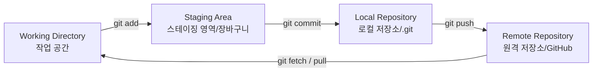

# Git (분산 버전 관리 시스템)

Git은 로컬 환경에서 실행되는 빠르고 효율적인 분산 버전 관리 시스템(DVCS)입니다. 소스 코드의 변경 이력을 스냅샷 형태로 기록하여 빠른 브랜치 전환과 오프라인 작업을 지원합니다.

---

## 1. 버전 관리 시스템의 역사 및 비교

CVS와 SVN 등 이전 세대의 집중형 버전 관리 시스템과 비교했을 때, Git은 스냅샷 구조와 분산 아키텍처를 도입하여 협업의 성능과 유연성을 극대화했습니다.

| 구분 | CVS | SVN (Subversion) | Git |
| :--- | :--- | :--- | :--- |
| **관리 단위** | 파일 단위 버전 관리 | 커밋 단위 버전 관리 | 커밋 단위 버전 관리 |
| **저장 방식** | 파일별 증분(Diff/Delta) 저장 | 파일별 증분(Diff/Delta) 저장 | 스테이징 영역의 **스냅샷(Snapshot)** 압축 저장 |
| **특징** | 변경 이력 추적의 한계 | 파일 이동/이름 변경 지원, `.svn` 메타데이터 | 서버가 아닌 로컬에서 저장 및 이력 관리, 성능 우수 |
| **장단점** | 느린 속도, 브랜치 개념 부족 | 파일 용량 절약 가능하나, 이력이 길어지면 연산 속도 저하 | 브랜치 생성/전환 속도가 매우 빠르나, 다소 학습 곡선이 높음 |

---

## 2. Git의 핵심 메커니즘과 상태 주기

Git의 파일 관리는 세 가지 작업 영역(Working Directory, Staging Area, Local Repository)을 통해 이루어집니다.



### 2-1. 주요 명령어 및 메커니즘

* **`git add`**: 변경 사항(수정, 추가, 이동, 삭제)을 커밋하기 전에 임시 장바구니인 **Staging Area**에 올리는 작업입니다. 
  * 단순히 버전 관리 대상을 등록하는 일회성 명령이 아니라, 커밋할 스냅샷에 포함할 변경 사항을 지정하는 역할을 합니다.
  * 일부 파일만 나누어 스테이징 함으로써 논리적으로 분리된 작은 단우의 커밋 작성이 가능합니다.
* **`git commit`**: 스테이징 영역에 담긴 파일들의 상태를 스냅샷 형태로 로컬 저장소에 영구히 기록합니다.
  * **Diff 방식 vs Snapshot 방식**: SVN은 초기 저장본 이후의 차이점(Delta)을 계속 계산해 저장하므로 히스토리가 길어지면 속도가 느려집니다. 반면, Git은 커밋할 때의 전체 상태를 압축 파일(blob, tree 등)로 저장하고, 변경되지 않은 파일은 이전 버전을 단순히 링크(포인터)만 하므로 매우 빠릅니다.
* **`git blame`**: 파일의 각 행을 마지막으로 수정한 사람, 커밋 해시, 수정 시간 등을 출력하여 책임 소재 파악이나 버그 발생 시 전문가(가장 잘 아는 사람)를 확인할 때 유용합니다.
  ```bash
  git blame <파일명>
  ```

---

## 3. 작업 환경 전환 및 원복 (Checkout, Revert, Reset)

| 명령어 | 목적 | 이력 보존 여부 | 상세 설명 |
| :--- | :--- | :--- | :--- |
| **`git checkout`** / **`switch`** | 작업 공간 전환 | - | 브랜치를 변경하거나 과거 특정 시점으로 작업 공간의 상태를 전환합니다. (최신 버전에서는 브랜치 전환 시 `git switch`, 파일 복구 시 `git restore`로 명확히 분리하여 사용 권장) |
| **`git clone`** | 프로젝트 복제 | - | 원격 저장소의 전체 이력과 코드를 로컬에 최초로 일괄 다운로드합니다. |
| **`git revert`** | 커밋 취소 | **보존 (O)** | 기존 커밋의 변경 사항을 되돌리는 **새로운 커밋**을 생성합니다. 다른 협업자와 이미 공유된 커밋을 취소할 때 버전 충돌을 막기 위해 필수적입니다. |
| **`git reset`** | 커밋 되돌리기 | **삭제 (X)** | 헤드 포인터를 특정 과거 커밋으로 강제 이동시켜 이후의 커밋 이력을 지웁니다. (`--hard` 옵션 사용 시 워킹 디렉토리의 수정 사항까지 완전 유실되므로 주의 필요) |

---

## 4. 브랜치 병합과 충돌 해결

### 4-1. 브랜치 병합 (Merge)
* **3-way Merge**: 공통 조상(Base), 현재 브랜치(Branch 1), 대상 브랜치(Branch 2)의 3가지를 비교하여 병합을 수행합니다. 
* **Fast-forward**: 대상 브랜치가 현재 브랜치로부터 파생된 이후 현재 브랜치에 다른 커밋이 없는 경우, 단순히 포인터만 앞으로 이동시킵니다.

### 4-2. 충돌(Conflict) 해결 프로세스
두 브랜치에서 **동일한 파일의 동일한 줄(Line)**을 서로 다르게 수정하고 병합을 시도할 때 발생합니다.
1. 병합 명령 후 충돌이 발생하면 Git은 병합 커밋 생성을 일시 중단하고 대기 상태가 됩니다.
2. `git status`로 충돌이 발생한 파일을 확인합니다.
3. 소스 코드 내의 충돌 영역 지시자를 확인하고 수동으로 알맞은 코드를 선택 및 편집합니다.
   ```
   <<<<<<< HEAD (현재 브랜치의 코드)
   현재 작업 내용
   =======
   가져온 브랜치의 작업 내용
   >>>>>>> branch-name
   ```
4. 충돌 해결 후 편집 완료된 파일을 `git add <파일명>`으로 스테이징합니다.
5. `git commit`을 실행하여 병합 커밋 작성을 최종 완료합니다.
6. 만약 병합 작업이 꼬여서 중단하고 병합 이전 상태로 되돌리고 싶다면 `git merge --abort`를 수행합니다.

---

## 5. 원격 저장소 동기화 흐름

로컬과 원격(GitHub 등) 저장소의 상태를 일치시키기 위해 다음과 같은 표준 흐름을 따릅니다.

1. **`git pull`**: 원격 저장소의 최신 이력을 가져와서 현재 로컬 브랜치에 자동으로 병합(Merge)합니다. (즉, `git fetch` + `git merge`와 동일)
   * *주의*: 로컬에서 파일 수정을 시작하기 전에 항상 `git pull`을 수행하여 충돌을 사전에 방지해야 합니다.
2. **`git status`**: 현재 로컬 작업 공간의 변경 상태를 확인합니다.
3. **`git add .`**: 수정 사항 전체를 스테이징 영역에 담습니다.
4. **`git commit -m "메시지"`**: 작업 내용을 로컬 저장소에 커밋합니다.
5. **`git push origin main`**: 로컬의 커밋을 원격 저장소(`origin`의 `main` 브랜치)로 최종 업로드합니다.

---

## 6. 추가 고급 기능: Git Worktree

**Git Worktree**는 하나의 로컬 Git 저장소에서 여러 개의 워킹 디렉토리(작업 폴더)를 동시에 유지할 수 있게 해주는 기능입니다.
* 여러 브랜치를 동시에 열어서 작업해야 하거나, 현재 작업을 `stash` 하거나 `commit` 하지 않은 채 급하게 다른 브랜치의 버그를 수정해야 할 때 매우 유용합니다.

---

## 7. References & Sources (근거 자료)

* [[raw_MyNote/0 Git.md|raw_MyNote/0 Git.md]]: Git의 기본 명령어 사용 주기(1~8단계), CVS/SVN과 Git의 구조적 역사적 차이(diff vs snapshot 등), 충돌 해결 프로세스, Git Worktree 개념.
* [[Clippings/GitHub Docs. GitHub 설명서 시작하기 - GitHub 문서.md|Clippings/GitHub Docs. GitHub 설명서 시작하기 - GitHub 문서.md]]: 로컬 프로젝트 개발, 기본 쓰기 및 서식, 리포지토리 개념.
